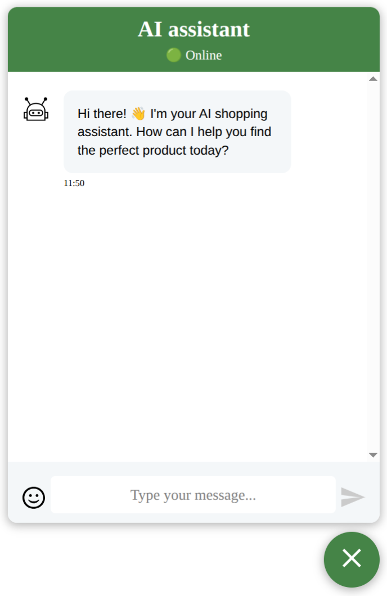
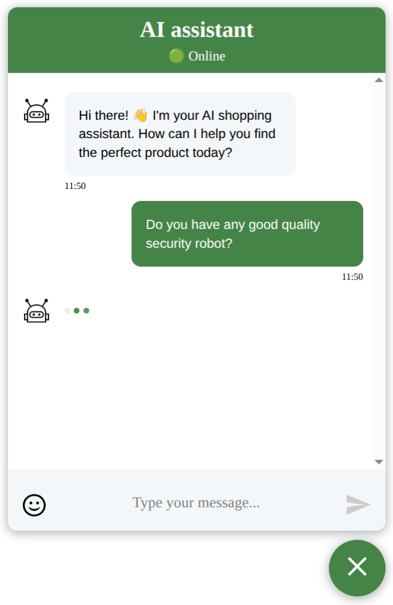
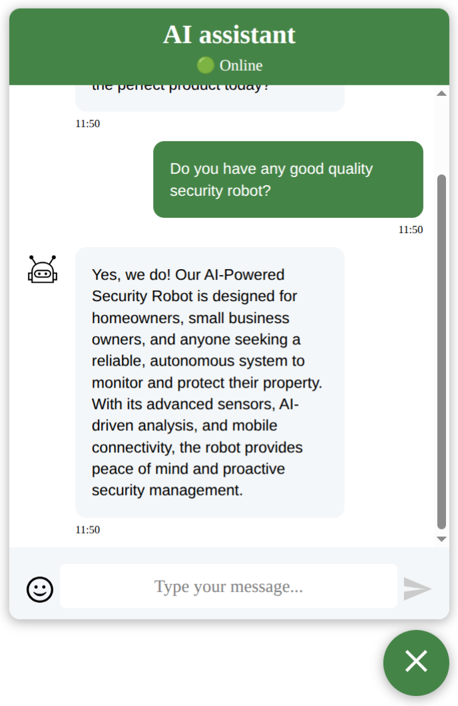

# Personalized-AI-Chatbot
An end-to-end AI assistant with Retrieval-Augmented Generation, designed for seamless integration with other projects.

<p style="display: flex; justify-content: space-between;">
  
  
  
</p>


## Project structure
```
Personalized-AI-Chatbot/
├── backend/
│   ├── main.py                     # FastAPI entrypoint, starts the server
│   ├── core/
│   │   ├── config.py               # Global config (CORS, settings, env vars)
│   │   └── logger.py               # Centralized logging setup (standard/logger)
│   ├── data_preprocessing/
│   │   ├── file_loader.py          # Load documents (txt, pdf) into memory
│   │   ├── text_cleaning.py        # Clean text (remove unwanted chars, normalize)
│   │   └── text_splitter.py        # Split text into chunks for embeddings
│   ├── rag/
│   │   ├── embedder.py             # Embedding model init & helper functions
│   │   ├── llm_model.py            # Local LLM loading & text generation
│   │   ├── pipeline.py             # RAGPipeline with retrieve/generate/answer
│   │   └── vectorstore.py          # Vectorstore management (add/retrieve embeddings)
│   ├── routers/
│   │   ├── chat.py                 # /ask endpoint for AI chatbot
│   │   └── health.py               # /health endpoint for health checks
│   ├── services/
│   │   └── rag_service.py          # Singleton RAGPipeline init for DI
│   ├── requirements.txt            # Backend Python dependencies
│   └── server.py                   # Optional server startup logic (uvicorn)
├── data/
│   └── docs/
│       └── ...                     # Source documents for RAG (txt, pdf, doc, html)
├── frontend/
│   ├── public/                     # Static assets (favicon, index.html)
│   ├── src/components/AIChatWindow/
│   │   ├── AIChatWindow.tsx        # Main React component for chat widget
│   │   └── AIChatLoader.tsx        # Custom loader/spinner for AI typing
│   ├── hooks/
│   │   └── useAIChat.ts            # Custom hook for sending messages to backend
│   ├── styles/
│   │   │   AIChatLoader.css        # Loader-specific styles
│   │   └── AIChatWindow.css        # Chat window styles
│   └── main.tsx                    # Frontend entrypoint
├── llm-models/
│   └── ...                         # Local LLM model files (gguf, pt, bin)
├── screenshots/                    # Screenshots for README/docs
├── .gitignore                      # Git ignore rules
├── LICENSE                         # Project license
├── README.md                       # Project documentation
└── docker-compose.yml              # Docker compose for backend/frontend

```

## License

Personalized-AI-Chatbot is released under the MIT license.

## Author

Sebastian Brzustowicz &lt;Se.Brzustowicz@gmail.com&gt;
